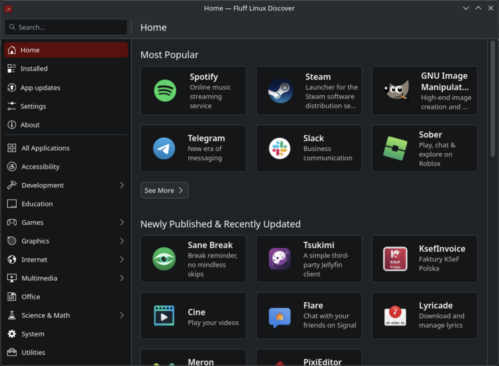

# Fluff Linux Discover

Fluff Linux Discover is the native KDE Plasma 6 application experience for
Fluff Linux. It provides a focused and approachable way to find, install,
remove, and update Flatpak applications.



This project is derived from KDE Discover and retains its familiar Plasma
interface while adapting the experience for Fluff Linux.

## Features

- Browse, search, install, launch, update, and remove Flatpak applications.
- Fast startup using locally cached application metadata.
- Manual or scheduled automatic app updates.
- Support for public, private, and internal Flatpak sources.
- Plasma theming, translations, and localization.

Fluff Linux Discover is intentionally Flatpak-only. System packages are updated
through [Fluff Linux Update](https://github.com/FluffNet/flufflinux-update).

## Build on Fluff Linux or Arch Linux

Install the build requirements:

```sh
sudo pacman -S --needed base-devel cmake extra-cmake-modules ninja \
    appstream-qt discount flatpak vulkan-headers \
    karchive kcmutils kconfig kcoreaddons kcrash kdbusaddons ki18n \
    kiconthemes kidletime kio kirigami kirigami-addons kitemmodels \
    kjobwidgets knotifications kservice kstatusnotifieritem \
    kwidgetsaddons kwindowsystem purpose qcoro qqc2-desktop-style \
    qt6-5compat qt6-base qt6-declarative qt6-webview
```

Configure and compile:

```sh
cmake -S . -B build -G Ninja \
    -DCMAKE_BUILD_TYPE=Release \
    -DCMAKE_INSTALL_PREFIX=/usr \
    -DKDE_INSTALL_LIBDIR=lib \
    -DBUILD_TESTING=OFF

cmake --build build
```

For a completely clean build, remove an older `build/` directory first.

## Stage for packaging

Fluff Linux packages are assembled from a fakeroot instead of being installed
directly onto the build machine:

```sh
# `fakeroot/` becomes the package filesystem and can then be packaged together with the bundled `.PKGINFO` file.
DESTDIR="$PWD/fakeroot" cmake --install build
```

Package contents will be staged below `fakeroot/`, beginning with
`fakeroot/usr/` and `fakeroot/etc/`. This does not modify the host system.

Use a clean `fakeroot/` for every package build. The package must use
`fakeroot/usr/lib`, not `fakeroot/usr/lib64`.

## Test locally

Run Discover from the build tree:

```sh
./build/bin/plasma-discover
```

On a disposable development system, install and test the build with:

```sh
sudo cmake --install build
kbuildsycoca6
plasma-discover
```

## Reporting issues

Report problems through the
[Fluff Linux Discover issue tracker](https://github.com/FluffNet/flufflinux-discover/issues).

## Upstream and license

Fluff Linux Discover is derived from
[KDE Discover](https://invent.kde.org/plasma/discover). KDE copyright notices,
original authorship, and source history are preserved.

Each source file remains governed by its SPDX license identifier. Complete
license texts are available in [`LICENSES/`](LICENSES/).
